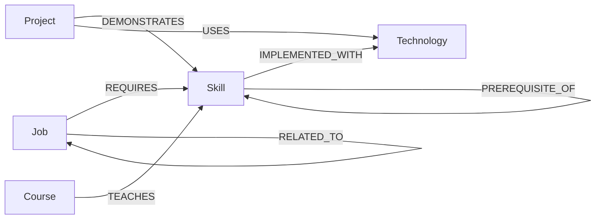

# CareerGraph

CareerGraph is a career exploration and skill-gap application powered by **CognoDB**, accessed through its Bolt connection with the official Neo4j Python driver. It maps the path from a target role to the skills, technologies, courses, and portfolio projects that make that role attainable.

## What it does

- **Job Explorer** — browse roles and see required skills, the technology stack, learning resources, projects, and nearby career paths.
- **Skill Gap Analyzer** — select what you already know and calculate missing skills, coverage percentage, and a recommended first course.
- **Connection Explorer** — inspect the connected neighborhood around a role with a graph-style visualization and raw relationship paths.
- **Graceful database states** — the API starts cleanly when CognoDB is unavailable and the UI shows a useful connection message instead of a blank screen.

## Why a graph database?

Career data is relationship-heavy. A person does not simply belong to a list of skills: a job requires skills, skills are implemented with technologies, courses teach skills, projects demonstrate them, and jobs connect to other jobs through shared requirements. In a relational design, exploring a question such as “which courses and projects cover the missing skills for this role, and which adjacent jobs reuse those skills?” requires several join tables and increasingly complex multi-join queries.

CognoDB stores those connections directly as relationships. The same question is expressed as a readable traversal such as:

```cypher
MATCH (j:Job)-[:REQUIRES]->(s:Skill)<-[:TEACHES]-(c:Course)
```

This makes paths first-class, keeps the model close to how people think about career progression, and makes it easy to add new node types or relationship types later without redesigning a central table. Graph traversals are particularly valuable for recommendations, adjacency, prerequisites, and skill-gap paths.

## Graph data model



### Nodes

| Node | Important properties |
|---|---|
| `Job` | `title`, `category`, `description`, `avg_salary` |
| `Skill` | `name`, `category`, `description` |
| `Technology` | `name`, `category`, `description` |
| `Course` | `title`, `provider`, `url`, `level`, `hours` |
| `Project` | `title`, `description`, `difficulty` |

### Relationships

`Job-[:REQUIRES]->Skill`, `Skill-[:IMPLEMENTED_WITH]->Technology`, `Course-[:TEACHES]->Skill`, `Project-[:DEMONSTRATES]->Skill`, `Project-[:USES]->Technology`, `Job-[:RELATED_TO]->Job`, and `Skill-[:PREREQUISITE_OF]->Skill`.

## Project structure

```text
careergraph/
├── backend/
│   ├── main.py              # FastAPI application and lifecycle
│   ├── config.py            # Environment-based settings
│   ├── db.py                # Shared official Neo4j driver
│   ├── models.py            # API response models
│   ├── queries.py           # Parameterized Cypher query catalog
│   ├── seed.py              # Realistic CognoDB seed data
│   ├── deps.py              # Connection availability dependency
│   ├── requirements.txt
│   └── routers/
│       ├── jobs.py
│       ├── catalog.py
│       ├── skill_gap.py
│       └── connections.py
├── src/
│   ├── App.tsx              # Responsive application experience
│   ├── api.ts               # Typed API client
│   ├── types.ts             # Shared frontend types
│   └── index.css            # Visual system and responsive styles
├── .env.example
└── README.md
```

## Setup

### 1. CognoDB

Create or access a CognoDB instance that exposes its Neo4j-compatible Bolt endpoint. Copy `.env.example` to `.env` and provide the three required values:

```text
COGNODB_URI=bolt://your-cognodb-host:7687
COGNODB_USERNAME=your-username
COGNODB_PASSWORD=your-password
```

`COGNODB_DATABASE` is optional and defaults to `neo4j`. The application never sends these credentials to the browser.

### 2. Backend

From the project root:

```bash
python3 -m venv .venv
source .venv/bin/activate
pip install -r backend/requirements.txt
python -m backend.seed
uvicorn backend.main:app --reload --port 8000
```

The seed script creates uniqueness constraints, clears existing graph data, and loads realistic data for ten roles, 25 skills, 24 technologies, 25 courses, and 18 projects. It creates every required relationship type. Run it only when you intend to replace the graph contents.

FastAPI's interactive API documentation is available at `http://localhost:8000/docs`.

### 3. Frontend

Install the JavaScript dependencies and start the existing Vite development server. The frontend defaults to `http://localhost:8000`; set `VITE_API_URL` for a deployed backend.

## Main Cypher queries

All user-controlled values are passed as parameters. No input is concatenated into Cypher.

**Job → Skill**

```cypher
MATCH (j:Job {title: $title})-[:REQUIRES]->(s:Skill)
RETURN s.name, s.category, s.description
```

**Mandatory multi-hop Job → Skill → Technology**

```cypher
MATCH (j:Job {title: $title})-[:REQUIRES]->(s:Skill)-[:IMPLEMENTED_WITH]->(t:Technology)
RETURN s.name AS skill, collect(DISTINCT t.name) AS technologies
```

**Job → Skill ← Course**

```cypher
MATCH (j:Job {title: $title})-[:REQUIRES]->(s:Skill)<-[:TEACHES]-(c:Course)
RETURN s.name AS skill, collect(c) AS courses
```

**Job → Skill ← Project**

```cypher
MATCH (j:Job {title: $title})-[:REQUIRES]->(s:Skill)<-[:DEMONSTRATES]-(p:Project)
RETURN s.name AS skill, collect(p) AS projects
```

**Related careers through shared skills**

```cypher
MATCH (j:Job {title: $title})-[:REQUIRES]->(s:Skill)<-[:REQUIRES]-(other:Job)
WHERE other.title <> $title
RETURN other, collect(DISTINCT s.name) AS shared_skills
```

**Skill-gap analysis**

```cypher
MATCH (j:Job {title: $title})-[:REQUIRES]->(s:Skill)
WITH collect(s.name) AS required
RETURN [skill IN required WHERE NOT skill IN $have_skills] AS missing
```

## Local run notes

The frontend and backend are intentionally separate so they can be deployed independently. In development, run CognoDB, the FastAPI service on port 8000, and the Vite frontend on port 5173. The backend allows those local origins through CORS.

## Screenshots

The live UI includes a dark graph-workbench aesthetic with:

- role browser and responsive job list
- requirement cards and technology chips
- course and project recommendation panels
- readiness ring and selectable skill picker
- connected-node relationship view

Add deployment screenshots here when presenting the assignment.

## Assignment requirements checklist

- [x] React frontend
- [x] Python/FastAPI backend
- [x] CognoDB Bolt connection through the official Neo4j driver
- [x] Environment-only credentials; no credentials in frontend
- [x] Realistic seed script and graph data
- [x] All requested node types
- [x] All requested relationship types
- [x] Parameterized Cypher queries
- [x] Job → Skill traversal
- [x] Mandatory Job → Skill → Technology multi-hop traversal
- [x] Job → Skill ← Course traversal
- [x] Job → Skill ← Project traversal
- [x] Job → Skill ← Job related-career traversal
- [x] Skill-gap analysis
- [x] API endpoints for jobs, details, skills, technologies, courses, projects, related jobs, and skill gap
- [x] Loading, empty, and database-error states
- [x] Responsive polished UI
- [x] Setup, model diagram, graph-database rationale, query explanations, structure, local run, screenshots, and checklist
